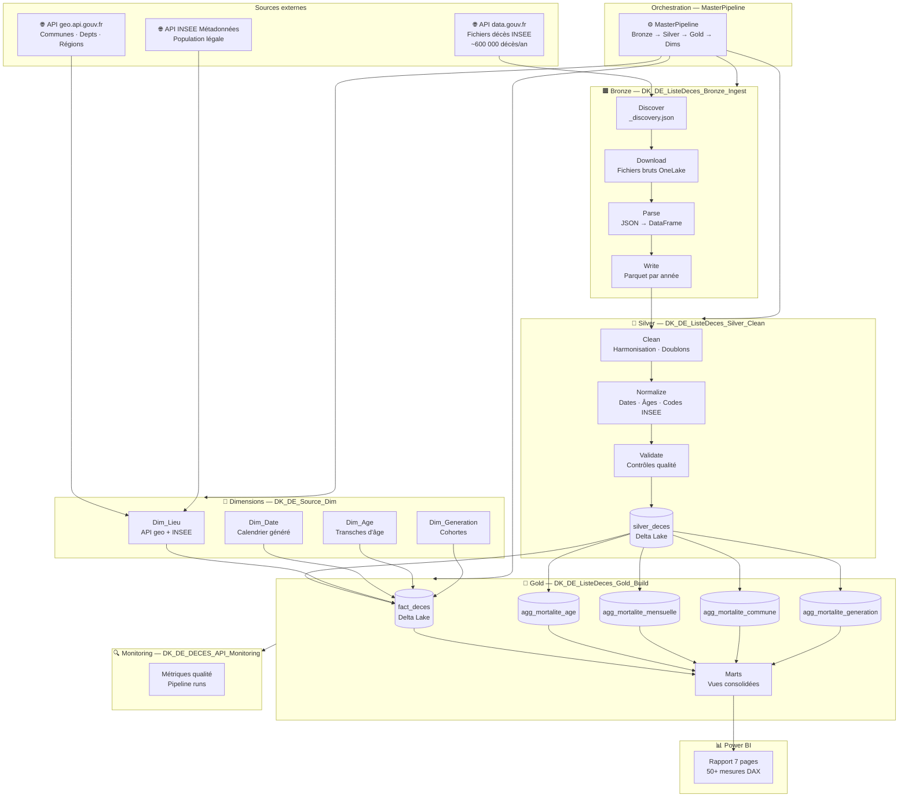

# Présentation de l'architecture : DK-DE-DECES· Microsoft Fabric

> Pipeline Medallion complet-Ingestion API → Delta Lake → Power BI

---

## Vue d'ensemble

Ce projet implémente une **architecture Médallion** (Bronze / Silver / Gold) sur Microsoft Fabric. Chaque couche a une responsabilité unique et produit des données consommables par la couche suivante via Delta Lake sur OneLake.




---

## Détail par couche

### Bronze : Ingestion brute

**Lakehouse** : `DK_DE_ListeDeces_Bronze_Ingest`  
**Principe** : conserver les données sources dans leur format d'origine. Aucune transformation métier.

| Notebook | Rôle | Sortie |
|---|---|---|
| `01_Bronze-Discover` | Interroge l'API data.gouv.fr, liste les ressources disponibles selon l'environnement | `_discovery.json` |
| `01_Bronze-Download` | Télécharge les fichiers avec retry, timeout adaptatif, skip_existing | Fichiers bruts dans OneLake Files |
| `01_Bronze-Parse` | Lit les fichiers texte bruts, structure en DataFrame Spark | DataFrame Spark en mémoire |
| `01_Bronze-Write` | Écrit en Parquet partitionné par année | Parquet dans OneLake |

**Résilience** : retry configurable, gestion des timeouts, téléchargement incrémental (ne re-télécharge pas les fichiers déjà présents).

---

### Silver: Nettoyage et normalisation

**Lakehouse** : `DK_DE_ListeDeces_Silver_Clean`  
**Table** : `silver_deces`  
**Principe** : données techniquement propres et exploitables. Pas encore de modélisation analytique.

| Notebook | Rôle | Transformations clés |
|---|---|---|
| `02_Silver-Clean` | Nettoyage technique | Trim, uppercase, suppression doublons, standardisation sexe, zfill codes INSEE |
| `02_Silver-Normalize` | Normalisation métier | Parsing dates (naissance + décès), calcul âge, extraction département, AnMois |
| `02_Silver-Validate` | Contrôles qualité | Taux de null par colonne, volumétrie, plages valides (âge 0–145) |

**Règles de rejet** :
- `date_deces` non exploitable → ligne rejetée
- `age_au_deces` hors plage (< 0 ou > 145) → mis à null
- Code INSEE vide → `key_aggGeographie` sera null en Gold

---

### Gold : Modèle décisionnel

**Lakehouse** : `DK_DE_ListeDeces_Gold_Build`  
**Principe** : modèle en étoile optimisé pour Power BI. Données pré-agrégées pour la performance.

#### fact_deces

Table de faits à granularité individuelle (1 ligne = 1 décès).  
Contient toutes les colonnes Silver + 4 clés de jointure vers les tables d'agrégation.

#### Tables d'agrégation

| Table | Granularité | Usage BI principal |
|---|---|---|
| `agg_mortalite_age` | Âge exact × AnMois | Pyramide des décès, évolution par âge |
| `agg_mortalite_mensuelle` | Mois | Tendances temporelles, saisonnalité |
| `agg_mortalite_commune` | Commune (toute période) | Carte, classements, comparaison locale |
| `agg_mortalite_generation` | Cohorte × commune × âge | Analyse générationnelle |

---

### Dimensions

**Lakehouse** : `DK_DE_Source_Dim`  
**Mise à jour** : planifiée habdomadairement (PipelineDimensions avec schedule)

| Dimension | Source | Clé primaire |
|---|---|---|
| `dim_lieu` | API geo.api.gouv.fr + INSEE population | `id_commune` (code INSEE 5 car.) |
| `dim_date` | Générée programmatiquement | `id_date` (yyyyMM) |
| `dim_age` | Générée (0–150) | `age` |
| `dim_generation` | Générée (cohortes par décennie) | `annee_naissance` |

---

### Orchestration

```
MasterPipeline
├── BronzePipeline     (timeout 15 min, retry 1)
├── SilverPipeline     (dépend de Bronze → Succeeded)
├── GoldPipeline       (dépend de Silver → Succeeded)
└── MonitoringPipeline (dépend de Gold → Succeeded/Failed)

PipelineDimensions     (planifié séparément - hebdomadaire)
```

**Détection d'environnement** : chaque notebook détecte automatiquement `dev` / `test` / `prod` via le nom du workspace, ce qui permet de limiter le volume de données en développement.

---

### Monitoring

**Lakehouse** : `DK_DE_DECES_API_Monitoring`

| Notebook | Données produites |
|---|---|
| `90_Monitoring-Metrics` | KPIs de qualité (taux de null, taux de rejet, volumétrie par couche) |
| `90_Monitoring-PipelineRuns` | Historique des exécutions (statut, durée, lignes traitées) |

---

## Modèle en étoile Power BI

```
                    dim_date
                       │
dim_generation ──── fact_deces ──── dim_lieu
                       │
                    dim_age
                       │
              agg_mortalite_age
              agg_mortalite_mensuelle
              agg_mortalite_commune
              agg_mortalite_generation
```

Les tables d'agrégation sont reliées à `fact_deces` via les clés composites (`key_aggAge`, `key_aggTemporel`, `key_aggGeographie`, `key_aggGeneration`).

---

## Utilitaires partagés (`99_Utils`)

| Notebook | Contenu |
|---|---|
| `Utils-DeltaUtils` | Helpers MERGE, VACUUM, OPTIMIZE, gestion du Change Data Feed |
| `Utils-LoggingUtils` | Logging structuré centralisé (niveau, timestamp, contexte) |
| `Utils-ParsingUtils` | Parsing des fichiers sources INSEE (format texte fixe) |
| `Utils-SparkUtils` | Configuration session Spark, paramètres de performance |
| `Utils-ValidationUtils` | Contrôles qualité réutilisables (null check, volumétrie, plages) |

Ces notebooks sont importés en tant que dépendances dans les notebooks de traitement via `%run` ou `notebookutils.notebook.run()`.
